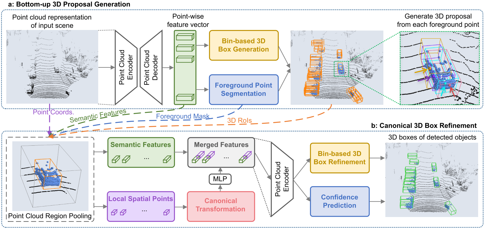

<table width="100%" align="center" border="0">
<tr>
    <td width="60%" valign="middle">
        <h1 style="margin-top:20px;margin-bottom:36px;">Shaoshuai SHI</h1>
        

	        Ph.D. Student  
	        The Chinese University of Hong Kong
        

        <!-- Email: ssshi [at] ee [dot] cuhk [dot] edu [dot] hk -->
        Email: shaoshuaics [at] gmail [dot] com
        

        	<a href="">[CV]</a> &nbsp;
            <a href="https://scholar.google.com.hk/citations?user=DC9wzBgAAAAJ&hl=zh-CN">[Google Scholar]</a> &nbsp;
            <a href="https://github.com/sshaoshuai">[GitHub]</a>
        

    </td>
    <td width="40%" align="center">
        
    </td>
</tr>
</table>

## About Me

I am currently a second-year Ph.D. student in [Multimedia Lab (MMLab)](http://mmlab.ie.cuhk.edu.hk/), The Chinese University of Hong Kong (CUHK), supervised by Prof. [Xiaogang Wang](http://www.ee.cuhk.edu.hk/~xgwang) and Prof. [Hongsheng Li](http://www.ee.cuhk.edu.hk/~hsli/). Before that, I received my bachelor's degree from the Computer Science Honor Class of Harbin Institute Technology (HIT) in July 2017.

My research interests focuses on computer vision and deep learning, especially the 3D scene understanding.

## Experiences

* [July 2016 ~ July 2017] Research intern at the System Group of Microsoft Research Asia (MSRA), Beijing, China.

## Selected Publications

For the full publication list, please refer to the [Google Scholar](https://scholar.google.com.hk/citations?user=DC9wzBgAAAAJ&hl=zh-CN).

<table class="">
<tr>
    <td width="35%">
        
    </td>
    <td width="65%" valign="middle">
        
<b>
        PointRCNN: 3D Object Proposal Generation and Detection from Point Cloud
    	</b>
    	

        

            <b>Shaoshuai Shi</b>, Xiaogang Wang, Hongsheng Li
        

        <em>
	        IEEE Conference on Computer Vision and Pattern Recognition
	    	</em> 
	    	(<b>CVPR</b>), 2019.
    	
        

            <a href="content/pdf/PointRCNN.pdf" style="">[Paper]</a> &nbsp;
            <a href="https://github.com/sshaoshuai/PointRCNN" style="">[Code]</a> &nbsp;
            <a href="" style="">[Project Page]</a>
        

    </td>
</tr>
</table>

## Honors & Awards

* [Hong Kong PhD Fellowship](https://cerg1.ugc.edu.hk/hkpfs/index.html) (The highest scholarship for PhD students in Hong Kong), 2017-2021
* National Scholarship (three times), 2014-2016
* [China Collegiate Programming Contest (CCPC 2015)](https://ccpc.io/), Silver Prize, 2015
* [China Undergraduate Mathematical Contest in Modeling (CUMCM 2015)](http://en.mcm.edu.cn/), Second Prize, 2015

 
