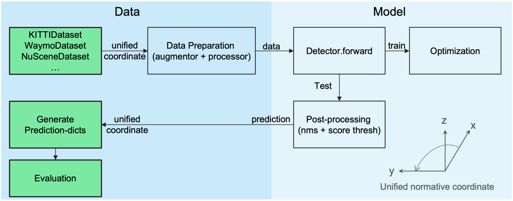

<table width="100%" align="center" border="0">
<tr>
    <td width="60%" valign="middle">
        <h1 style="margin-top:18px;margin-bottom:36px;">Shaoshuai Shi</h1>
        

	        <b>Postdoctoral Researcher</b>  
            <a href="https://www.mpi-inf.mpg.de/departments/computer-vision-and-machine-learning">Department of Computer Vision and Machine Learning</a>   
	        <a href="https://www.mpi-inf.mpg.de/home/">Max Planck Institute for Informatics</a>
              
            Email: shaoshuaics [at] gmail [dot] com
            <!-- Office: E14-613, MPI-INF, Saarland Informatics Campus -->
        

        

            <a href="https://scholar.google.com.hk/citations?user=DC9wzBgAAAAJ&hl=zh-CN">[Google Scholar]</a> &nbsp;
            <a href="https://github.com/sshaoshuai">[GitHub]</a> &nbsp;
            <!-- <a href="content/pdf/CV_SHIShaoshuai.pdf">[CV]</a> -->
        

    </td>
    <td width="40%" align="center">
        
    </td>
</tr>
</table>

## About Me

I am a postdoctoral researcher at [Max Planck Institute for Informatics (MPI-INF)](https://www.mpi-inf.mpg.de/home/), working with [Prof. Bernt Schiele](https://www.mpi-inf.mpg.de/departments/computer-vision-and-machine-learning/people/bernt-schiele). 
I obtained my Ph.D. degree from [Multimedia Lab (MMLab)](http://mmlab.ie.cuhk.edu.hk/) of The Chinese University of Hong Kong (CUHK), supervised by [Prof. Xiaogang Wang](http://www.ee.cuhk.edu.hk/~xgwang) and [Prof. Hongsheng Li](http://www.ee.cuhk.edu.hk/~hsli/). 
Before that, I received my bachelor's degree from the Computer Science Honor Class of Harbin Institute Technology (HIT). 

My research interests focus on computer vision and deep learning, especially the 3D scene understanding, object detection, motion prediction and autonomous driving / robotics related topics.

## News

 
* [2022/07] One paper accepted by ECCV 2022.
* [2022/06] Champion of [Waymo Open Dataset Motion Prediction challenge 2022](https://waymo.com/open/challenges/). More details will be released soon. 
* [2022/03] One paper accepted by CVPR 2022.
* [2022/01] The source code of [PV-RCNN++](https://arxiv.org/abs/2102.00463) has been released to [OpenPCDet](https://github.com/open-mmlab/OpenPCDet).
* [2021/07] Two papers accepted by ICCV 2021.
* [2021/07] I was awarded World Artificial Intelligence Conference Rising Star Award, see the [news](https://www.worldaic.com.cn/newsdetail?uuid=0577d6d5c6f449abb8a4f7426f5d17da) from [WAIC](https://www.worldaic.com.cn/).
* [2021/03] Two papers accepted by CVPR 2021.
<!-- * **[NEW]** [2020-06] 
PV-RCNN codes have been released to [[OpenPCDet]](https://github.com/open-mmlab/OpenPCDet). -->
<!-- * **[NEW]**   -->
* [2020/10] I was awarded Google PhD Fellowship 2020, see the [news](https://ai.googleblog.com/2020/10/announcing-2020-google-phd-fellows.html) from Google AI Blog. 
<!-- * **[NEW]**   -->
* [2020/06] Highly optimized PyTorch codebase [OpenPCDet](https://github.com/open-mmlab/OpenPCDet) for LiDAR-based 3D scene understanding is released.
<!-- , including the implementation of PV-RCNN, the 1st place method in the KITTI 3D detection leaderboard. -->
<!-- * **[NEW]**  -->
* [2020/06] We won 1st place among all LiDAR-only methods / 2nd place among all methods   on 3D Detection, 3D Tracking, Domain Adaptation three tracks of [Waymo Open Dataset challenge](https://waymo.com/open/challenges/). See the official [blog post](https://blog.waymo.com/2020/07/opendataset-challenge-winners.html) from Waymo. 
* [2020/03] Two papers with one oral accepted by CVPR 2020.
* [2020/02] One paper (Part-A2-Net) accepted by IEEE TPAMI.

<!-- 

* One paper got accepted by ICRA 2020.
* One paper got accepted by CVPR 2019.
* One paper got accepted by ICLR 2019.
* One paper got accepted by ECCV 2018.
<\p>
 -->

## General Codebase

<table class="">
<tr>
    <td width="30%" valign="top">
        
    </td>
    <td width="70%" valign="top">
        

        <a href="https://github.com/open-mmlab/OpenPCDet" style="">
            OpenPCDet: An Open-source Toolbox for 3D Object Detection from Point Cloud
        </a>
         
        OpenPCDet Development Team 
         
        <em>
      <!--       arXiv:1912.13192, Technical Report, 2019
            </em>  -->
            June 2020
            </em> 
        
         
        <a href="https://github.com/open-mmlab/OpenPCDet" style="">[Code]</a> &nbsp;   
            <a href="javascript:hideshow(document.getElementById('OpenPCDet'))"> [Bibtex] </a> &nbsp; 
             
         
        

    </td>
</tr>
</table>
<!-- <pre>

@inproceedings{shi2020pcdet,
  title={OpenPCDet: An Open-source Toolbox for 3D Object Detection from Point Cloud},
  author={Shi, Shaoshuai and Guo, Chaoxu and Li, Hongsheng},
  Journal ={https://github.com/open-mmlab/OpenPCDet},
  year={2020}
}

</pre> -->
<pre>

@misc{openpcdet2020,
    title={OpenPCDet: An Open-source Toolbox for 3D Object Detection from Point Clouds},
    author={OpenPCDet Development Team},
    howpublished = {\url{https://github.com/open-mmlab/OpenPCDet}},
    year={2020}
}

</pre>
<!-- 
## Technical Report

 -->

## Publications

*: Equal Contribution,  †: Corresponding Author

<!-- **Selected Preprints:** -->

* [Towards Efficient 3D Object Detection with Knowledge Distillation](https://arxiv.org/abs/2205.15156)  
Jihan Yang, <b>Shaoshuai Shi</b>, Runyu Ding, Zhe Wang, Xiaojuan Qi  
*Preprint, arXiv:2205.15156.*

<!-- **2022:** -->
* [MPPNet: Multi-Frame Feature Intertwining with Proxy Points for 3D Temporal Object Detection](https://arxiv.org/abs/2205.05979)  
Xuesong Chen\*, <b>Shaoshuai Shi\*†</b>, Benjin Zhu, Ka Chun Cheung, Hang Xu, Hongsheng Li†  
*European Conference on Computer Vision (ECCV), 2022.*
[[Code]](https://github.com/open-mmlab/OpenPCDet) &nbsp;  
Ranked 1st place on Waymo 3D object detection leaderboard (June, 2022).

* [RBGNet: Ray-based Grouping for 3D Object Detection](https://arxiv.org/abs/2204.02251)  
Haiyang Wang, <b>Shaoshuai Shi† </b>, Ze Yang, Rongyao Fang, Qi Qian, Hongsheng Li, Bernt Schiele, Liwei Wang  
*IEEE Conference on Computer Vision and Pattern Recognition (CVPR), 2022.* 
&nbsp; [[Code]](https://github.com/Haiyang-W/RBGNet) &nbsp;  

<!-- **2021:** -->
* [LIGA-Stereo: Learning LiDAR Geometry Aware Representations for Stereo-based 3D Detector](https://arxiv.org/abs/2108.08258)  
Xiaoyang Guo, <b>Shaoshuai Shi</b>, Xiaogang Wang, Hongsheng Li  
*International Conference on Computer Vision (ICCV), 2021.* 
&nbsp;[[Code]](https://github.com/xy-guo/LIGA-Stereo) &nbsp; 

* [Guided Point Contrastive Learning for Semi-Supervised Point Cloud Semantic Segmentation](https://arxiv.org/abs/2110.08188)  
Li Jiang, <b>Shaoshuai Shi</b>, Zhuotao Tian, Xin Lai, Shu Liu, Chi-Wing Fu, Jiaya Jia  
*International Conference on Computer Vision (ICCV), 2021.* 

* [ST3D++: Self-training for Unsupervised Domain Adaptation on 3D Object Detection](https://arxiv.org/abs/2108.06682)  
Jihan Yang, <b>Shaoshuai Shi</b>, Zhe Wang, Hongsheng Li, Xiaojuan Qi  
*Preprint, arXiv:2108.06682.*

* [PV-RCNN++: Point-Voxel Feature Set Abstraction With Local Vector Representation for 3D Object Detection](https://arxiv.org/abs/2102.00463)  
<b>Shaoshuai Shi</b>, Li Jiang, Jiajun Deng, Zhe Wang, Chaoxu Guo, Jianping Shi, Xiaogang Wang, Hongsheng Li  
*Preprint, arXiv:2102.00463.* &nbsp;[[Code]](https://github.com/open-mmlab/OpenPCDet) &nbsp;

* [ST3D: Self-training for Unsupervised Domain Adaptation on 3D Object Detection](https://arxiv.org/abs/2103.05346)  
Jihan Yang\*, <b>Shaoshuai Shi\*</b>, Zhe Wang, Hongsheng Li, Xiaojuan Qi  
*IEEE Conference on Computer Vision and Pattern Recognition (CVPR), 2021.* 
&nbsp;[[Code]](https://github.com/CVMI-Lab/ST3D) &nbsp; 

* [Back-tracing Representative Points for Voting-based 3D Object Detection in Point Clouds](https://arxiv.org/abs/2104.06114)  
Bowen Cheng, Lu Sheng, <b>Shaoshuai Shi</b>, Ming Yang, Dong Xu  
*IEEE Conference on Computer Vision and Pattern Recognition (CVPR), 2021.* 
&nbsp;[[Code]](https://github.com/cheng052/BRNet) &nbsp; 

* [Voxel R-CNN: Towards High Performance Voxel-based 3D Object Detection](https://arxiv.org/abs/2012.15712)  
Jiajun Deng, <b>Shaoshuai Shi</b>, Peiwei Li, Wengang Zhou, Yanyong Zhang, Houqiang Li  
*AAAI Conference on Artificial Intelligence (AAAI), 2021.* 
&nbsp;[[Code]](https://github.com/djiajunustc/Voxel-R-CNN) &nbsp; 

<!-- **2020** -->
* [The Top-Performing LiDAR-only Solutions for 3D Detection / 3D Tracking / Domain Adaptation of Waymo Open Dataset Challenges](https://arxiv.org/abs/2008.12599)  
<b>Shaoshuai Shi</b>, Chaoxu Guo, Jihan Yang, Hongsheng Li  
*Technical report of top-performing LiDAR-only solutions to Waymo Open Dataset Challenges at Workshop of CVPR 2020.* 
&nbsp;[[Code]](https://github.com/open-mmlab/OpenPCDet) &nbsp; 

* [PV-RCNN: Point-Voxel Feature Set Abstraction for 3D Object Detection](https://arxiv.org/abs/1912.13192)  
<b>Shaoshuai Shi</b>, Chaoxu Guo, Li Jiang, Zhe Wang, Jianping Shi, Xiaogang Wang, Hongsheng Li  
*IEEE Conference on Computer Vision and Pattern Recognition (CVPR), 2020.* 
&nbsp;[[Code]](https://github.com/open-mmlab/OpenPCDet) &nbsp;   
Ranked 1st place on KITTI 3D object detection benchmark (Car, Nov 2019 - Aug 2020).

* [PointGroup: Dual-Set Point Grouping for 3D Instance Segmentation](https://arxiv.org/abs/2004.01658)  
Li Jiang, Hengshuang Zhao, <b>Shaoshuai Shi</b>, Shu Liu, Chi-Wing Fu, Jiaya Jia  
*IEEE Conference on Computer Vision and Pattern Recognition (CVPR), 2020.*
**[Oral]**
&nbsp;[[Code]](https://github.com/Jia-Research-Lab/PointGroup) &nbsp;  
Ranked 1st place on ScanNet 3D Semantic instance benchmark (Nov-16 2019).  

* [From Points to Parts: 3D Object Detection from Point Cloud with Part-aware and Part-aggregation Network](https://arxiv.org/abs/1907.03670)  
<b>Shaoshuai Shi</b>, Zhe Wang, Jianping Shi, Xiaogang Wang, Hongsheng Li  
*IEEE Transactions on Pattern Analysis and Machine Intelligence (T-PAMI), accepted.*
&nbsp; <a href="https://github.com/open-mmlab/OpenPCDet" style="">[Code]</a>     
ESI Hot and Highly Cited Paper (top 0.1%).  
Ranked 1st place on KITTI 3D object detection benchmark (Car, July-9 2019).  

* [SegVoxelNet: Exploring Semantic Context and Depth-aware Features for 3D Vehicle Detection from Point Cloud](https://arxiv.org/abs/2002.05316)  
Hongwei Yi, <b>Shaoshuai Shi</b>, Mingyu Ding, Jiankai Sun, Kui Xu, Hui Zhou, Zhe Wang, Sheng Li, Guoping Wang  
*International Conference on Robotics and Automation (ICRA), 2020.*

<!-- **Before 2020** -->

* [PointRCNN: 3D Object Proposal Generation and Detection from Point Cloud](https://arxiv.org/abs/1812.04244)  
 <b>Shaoshuai Shi</b>, Xiaogang Wang, Hongsheng Li  
*IEEE Conference on Computer Vision and Pattern Recognition (CVPR), 2019.*
&nbsp; <a href="https://github.com/sshaoshuai/PointRCNN" style="">[Code-v1]</a> <a href="https://github.com/open-mmlab/OpenPCDet" style="">[Code-v2]</a>   
The top-10 cited papers among all CVPR-2019 papers (March, 2021), refer to <a href="https://www.paperdigest.org/2021/03/most-influential-cvpr-papers-2021-03/" style="">here.</a>

* [Feature Intertwiner for Object Detection](https://arxiv.org/abs/1903.11851)  
Hongyang Li, Bo Dai, <b>Shaoshuai Shi</b>, Wanli Ouyang, Xiaogang Wang  
*International Conference on Learning Representation (ICLR), 2019.*

* [GAL: Geometric Adversarial Loss for Single-View 3D-Object Reconstruction](https://eccv2018.org/openaccess/content_ECCV_2018/papers/Li_Jiang_GAL_Geometric_Adversarial_ECCV_2018_paper.pdf)  
Li Jiang, <b>Shaoshuai Shi</b>, Xiaojuan Qi, Jiaya Jia   
*European Conference on Computer Vision (ECCV), 2018.* **[Oral]**

* [FP-DNN: An Automated Framework for Mapping Deep Neural Networks onto FPGAs with RTL-HLS Hybrid Templates](http://cadlab.cs.ucla.edu/beta/cadlab/sites/default/files/publications/fccm2017.pdf)  
Yijin Guan, Hao Liang, Ningyi Xu, Wenqiang Wang, <b>Shaoshuai Shi</b>, Xi Chen, Guangyu Sun, Wei Zhang, Jason Cong   
*IEEE Field-Programmable Custom Computing Machines (FCCM), 2017.*  

<!-- ## Invited Talks

* [2020-06-24] VALSE Webinar: Deep Learning on Point Clouds for 3D Object Detection. [[Link (Chinese)]](https://www.bilibili.com/video/BV15K411H7wf?from=search&seid=2278904913441168463)
* [2020-06-16] PV-RCNN: The Top-Performing LiDAR-only Solutions for 3D Detection / 3D Tracking / Domain Challenges of Waymo Open Dataset Challenges. [[Link]](https://sites.google.com/view/cvpr20-scalability/archived-talks/challenges)
 -->

## Experience

* Postdoc Researcher, Oct 2021 - Now, Max Planck Institute for Informatics, Germany.  
Advised by Prof. Bernt Schiele.

* Research Intern, Mar 2019 - Feb 2021, Autonomous Driving Group of SenseTime, Shenzhen, China.  
Working with Dr. Zhe Wang and Dr. Jianping Shi.

* Research Intern, July 2016 - July 2017,  System Group of Microsoft Research Asia (MSRA), Beijing, China.  
Advised by Prof. Ningyi Xu.  

## Honors & Awards

* Champion of [Waymo Open Dataset Motion Prediction challenge](https://waymo.com/open/challenges/), 2022.
* [World Artificial Intelligence Conference (WAIC)](https://www.worldaic.com.cn/newsdetail?uuid=0577d6d5c6f449abb8a4f7426f5d17da) Rising Star Award (17 selected world-wide), 2021.
* [Google PhD Fellowship](https://ai.googleblog.com/2020/10/announcing-2020-google-phd-fellows.html) in machine perception (10 selected world-wide), 2020.
* [Hong Kong PhD Fellowship](https://cerg1.ugc.edu.hk/hkpfs/index.html) (The highest scholarship for PhD students in Hong Kong), 2017-2021
* National Scholarship, 2014, 2015, 2016
* Silver Prize of [China Collegiate Programming Contest (CCPC 2015)](https://ccpc.io/post/91), 2015
* Second Prize of [China Undergraduate Mathematical Contest in Modeling (CUMCM 2015)](http://en.mcm.edu.cn/), 2015
* Gold Prize of [China Collegiate Programming Contest (CCPC) of Northeast Area](https://ccpc.io/), 2015
<!-- * First Prize of Mathematical Modeling Contest of Northeast Area, 2015 -->
<!-- * First Class Scholarship of HIT (six times at each semester), 2014-2016 -->

 

© Shaoshuai Shi, 2019 - 2022
